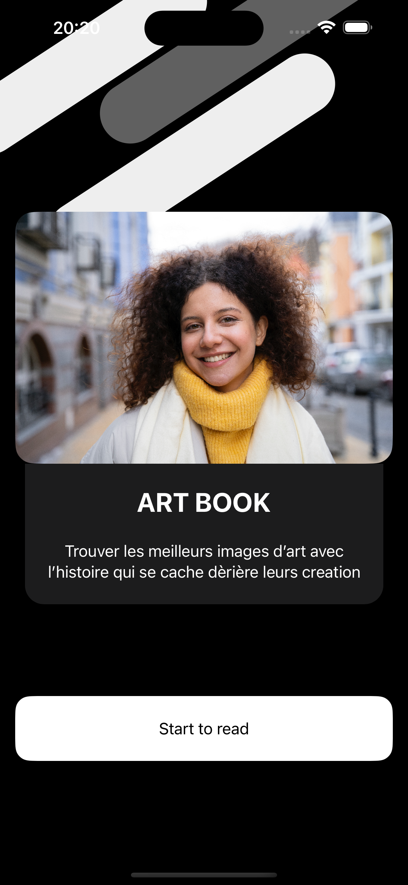
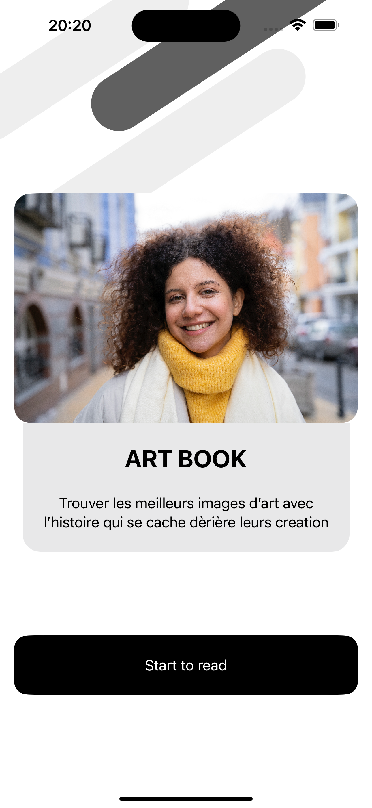
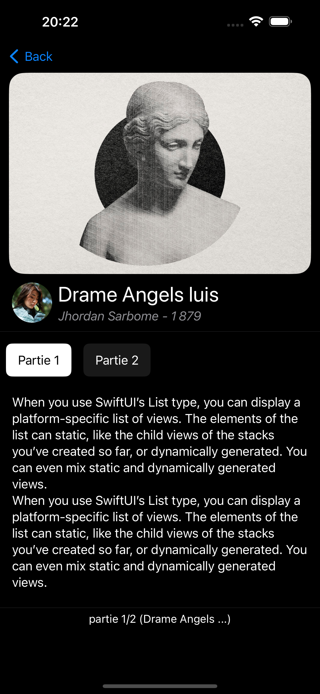

# Art Book

**Art Book** est une application iOS qui vous permet de découvrir l'histoire derrière chaque œuvre d'art et d'explorer les talents d'auteurs.

## Description

**Art Book** vous emmène dans un voyage à travers le monde de l'art, où chaque œuvre est accompagnée d'une histoire captivante. Que vous soyez un amateur d'art ou un passionné, cette application vous permettra de plonger au cœur de la création artistique.

## Langage Utilisé

L'application **Art Book** est écrite en SwiftUI, un framework moderne pour la création d'interfaces utilisateur sur les plateformes Apple.

## Captures d'écran

  
  

  
  

  

## Installation

Pour installer **Art Book** sur votre appareil iOS, suivez les étapes suivantes :
1. Clonez ce dépôt sur votre machine locale.
2. Ouvrez le projet dans Xcode.
3. Connectez votre appareil iOS et sélectionnez-le comme périphérique de déploiement.
4. Appuyez sur le bouton "Run" dans Xcode pour lancer l'application sur votre appareil.

## Contributeurs

- David Amouzou

